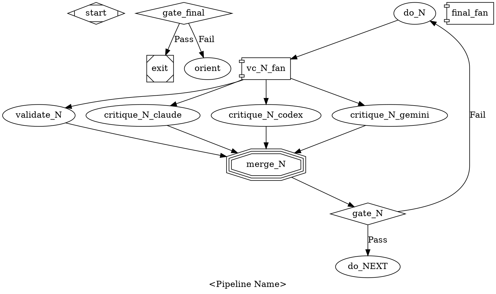

# Attractor Pipeline Seed Template

A generalized template for building rigorous, self-correcting attractor pipelines with multi-model consensus.

## Architecture

Every sprint follows the same loop:

```
DO work → VALIDATE + CRITIQUE (parallel) → MERGE consensus → GATE
  ↓ pass: next sprint
  ↓ fail: repeat DO with failure context
```

After all sprints:

```
FINAL VALIDATE + CRITIQUE (parallel) → MERGE → GATE
  ↓ pass: exit
  ↓ fail: restart from orient with failure context
```

### Node Roles

| Role | Shape | Purpose |
|------|-------|---------|
| **DO** | box (codergen) | Perform the work. Receives failure context from previous attempts. |
| **VALIDATE** | box (codergen) | Verify the work by exercising the system under test. Save evidence (screenshots, logs, artifacts) to a shared directory. Output `CONTEXT_SET: sprint_pass=true/false`. |
| **CRITIQUE** | box (codergen) | Independent review of the evidence. Multiple models review the same artifacts. No direct access to the system under test needed — pure analysis of saved evidence. |
| **FAN-OUT** | component (parallel) | Launches validate + all critique nodes concurrently. |
| **MERGE** | tripleoctagon (fan_in) | Consensus judge. Reads validation results and all critiques. Fixes real issues, dismisses false alarms. Outputs `CONTEXT_SET: sprint_pass=true/false` and `failure_context`. |
| **GATE** | diamond (conditional) | Routes on `context.sprint_pass=true` (next sprint) or `!=true` (repeat DO). |

### Key Principles

**1. Observe, don't infer.**
Validate by exercising the actual system — not by reading source code or running unit tests alone. If the deliverable is a UI, interact with it. If it's an API, call it. If it's a document, read it. Primary evidence comes from the system itself.

**2. Evidence is shared, not reproduced.**
The validate node captures evidence (screenshots, output logs, API responses) and saves it to a known directory. Critique nodes review that same evidence. This ensures all reviewers assess identical artifacts, regardless of their tool access.

**3. Multiple independent perspectives.**
At least three models critique independently. They have different strengths — one may catch visual issues another misses, one may notice logical gaps. The merge node resolves disagreements.

**4. Failure context accumulates.**
When a sprint fails, the merge node describes what's wrong. The DO node's prompt includes `$context.failure_context` so the next iteration targets the specific issues. Each retry is more informed than the last.

**5. Positive signals, not just absence of errors.**
"No errors found" is not sufficient. The validate node must observe the feature actually working — a tooltip appearing, a completion dropdown showing correct items, an output matching expected format. Define what a positive signal looks like for each behavior.

**6. Exhaustive permutations from the spec.**
If a specification defines N variants of a construct, test all N — not a sample. The spec is the test matrix. Every production rule, every operator, every edge case.

**7. The system under test decides, not the pipeline.**
When behavior depends on external data (server responses, dynamic content), ask the system what's available rather than hardcoding expectations. The pipeline adapts to the environment.

## Template Structure



## Writing Sprint Prompts

### DO Node Prompt Checklist
- [ ] References the relevant specification section
- [ ] Includes `Previous failure context: $context.failure_context`
- [ ] Describes the work to perform
- [ ] Instructs to verify via the actual system (not just tests)
- [ ] Instructs to save evidence to the shared directory
- [ ] Instructs to run automated checks after changes
- [ ] References implementation code and any reference implementations

### VALIDATE Node Prompt Checklist
- [ ] Clears previous evidence in the shared directory
- [ ] Exercises every behavior defined in the spec for this sprint
- [ ] Saves evidence with descriptive filenames
- [ ] Tests exhaustive permutations (all spec variants, not samples)
- [ ] Requires positive signals (feature works, not just no errors)
- [ ] Outputs `CONTEXT_SET: sprint_pass=true/false`
- [ ] Outputs `CONTEXT_SET: failure_context=<details>` on failure

### CRITIQUE Node Prompt Checklist
- [ ] Reads evidence from the shared directory (specific file patterns)
- [ ] Lists exactly what to look for in each piece of evidence
- [ ] Instructs to be harsh — report everything, no matter how minor
- [ ] Requires issue reports to reference the specific evidence file
- [ ] Does NOT require access to the system under test

### MERGE Node Prompt Checklist
- [ ] Reads validation results and all critique reports
- [ ] For each issue: determines real bug vs false alarm
- [ ] Fixes real bugs and re-verifies
- [ ] Outputs `CONTEXT_SET: sprint_pass=true/false`
- [ ] Outputs `CONTEXT_SET: failure_context=<what still fails>`

## Splitting Work into Sprints

Each sprint should be:
- **Isolated**: Completable and verifiable independently
- **Focused**: One behavioral domain (not a grab bag)
- **Ordered by dependency**: Later sprints may depend on earlier ones passing
- **Sized for one agent session**: Not so large that context is exhausted

Common sprint patterns:
1. **Foundation** — Core functionality that everything else depends on
2. **Intelligence** — Dynamic features (completions, suggestions, inference)
3. **Presentation** — Visual rendering, formatting, styling
4. **Integration** — How the component interacts with its environment
5. **Polish** — Edge cases, accessibility, error handling

## Evidence Types

| System Type | Evidence Format | How to Capture |
|-------------|----------------|----------------|
| Web UI | Screenshots (.png) | Playwright `browser_take_screenshot()` |
| API | Response JSON | `curl` or programmatic calls saved to files |
| CLI tool | Terminal output | Command output redirected to files |
| Document | The document itself | File path reference |
| Data pipeline | Output datasets | Saved to evidence directory |

## Prerequisites

The attractor engine must support:
- `CONTEXT_SET: key=value` parsing from LLM output (codergen handler)
- `$context.key` expansion in prompts (codergen handler)
- `component` shape for parallel fan-out
- `tripleoctagon` shape for fan-in with optional LLM consolidation
- `diamond` shape for conditional routing on context variables
